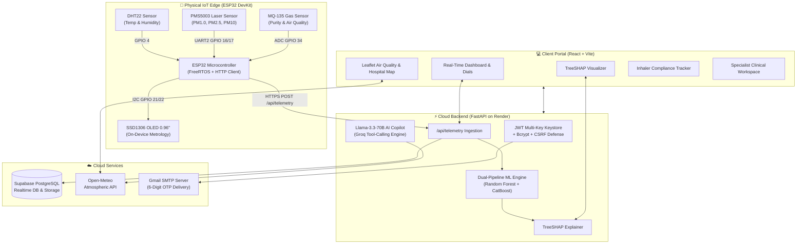

<div align="center">

# 🫁 RespiGuard.ai
### Intelligent IoT Edge Metrology, Dual-Pipeline ML & Explainable AI (TreeSHAP) Respiratory Care System

[](https://fastapi.tiangolo.com)
[](https://reactjs.org/)
[](https://vitejs.dev/)
[](https://www.espressif.com/)
[](https://supabase.com/)
[](https://groq.com/)
[](https://render.com)
[](LICENSE)

<p align="center">
  <b>A production-grade, clinical-tier IoT platform combining physical hardware sensing, hierarchical machine learning, TreeSHAP explainability, Open-Meteo atmospheric intelligence, and AES-256 encrypted telemedicine for precision asthma monitoring.</b>
</p>

</div>

---

## 📸 Platform Highlights

### 1. Real-Time Clinical Dashboard & Telemetry Overview
*Real-time continuous 5-parameter telemetry (PM2.5, PM10, PM1.0, Temperature, Humidity) streamed live from the ESP32 edge node, alongside instant AI Asthma Risk predictions and environmental purity index.*


---

### 2. Atmospheric Pollution Metrology & Emergency Hospital Routing
*Geospatial mapping integrating Open-Meteo regional weather feeds with OpenStreetMap & Leaflet. Automatically computes radial risk zones (1.5 km immediate, 3.5 km local, 6.5 km regional) and maps nearest emergency pulmonology centers across Bangladesh with one-tap turn-by-turn navigation.*


---

### 3. Microclimate Metrology: Indoor IoT vs. Outdoor Open-Meteo
*Side-by-side comparative analysis of localized indoor microclimate sensors (PMS5003 laser particulate counter & DHT22) versus regional outdoor Open-Meteo atmospheric metrics, including Ozone ($O_3$), $NO_2$, $CO$, $SO_2$, and UV Index.*


---

### 4. Explainable AI (TreeSHAP) Clinical Feature Attribution
*Zero black-box AI: Every asthma risk score is decomposed into exact mathematical feature contributions using TreeSHAP. Identifies protective factors versus acute risk triggers for full clinical transparency.*


---

### 5. Multi-Role Authentication & Gmail OTP Verification
*Enterprise-grade security supporting dual roles (Patients & Doctors) with multi-step credential verification and instant 6-digit HTML email OTP dispatch.*

<div align="center">
  <table width="100%">
    <tr>
      <td width="33%" align="center"><b>Authentication Portal</b><br></td>
      <td width="33%" align="center"><b>Patient Registration</b><br></td>
      <td width="33%" align="center"><b>Doctor Registration</b><br></td>
    </tr>
  </table>
</div>

<p align="center">
  <b>Instant Gmail 6-Digit Email Verification Code:</b><br>
  
</p>

---

### 6. Digital Inhaler & Medication Compliance Tracker
*Persistent audit log tracking daily preventive controllers (Fluticasone, Montelukast) and fast-acting rescue inhalers (Salbutamol). Tracks 7-day adherence streaks, automated dosage countdown timers, and canister refill reserves.*


---

### 7. Encrypted Consultations & Specialist Workspace
*Secure bi-directional clinical telemedicine channel with AES-256 encrypted messaging between verified pulmonologists and patients, featuring cohort pairing and 1-click clinical advisories.*

<div align="center">
  <table width="100%">
    <tr>
      <td width="50%" align="center"><b>Patient Telemedicine Chat</b><br></td>
      <td width="50%" align="center"><b>Specialist Clinical Workspace</b><br></td>
    </tr>
  </table>
</div>

---

### 8. AI Clinical Copilot (Groq Llama-3.3-70B Cloud)
*State-of-the-art conversational assistant powered by Groq Llama-3.3-70B with native function calling. Directly queries live ESP32 hardware sensors and Open-Meteo APIs in English, Bangla, and Banglish.*

<p align="center">
  
</p>

---

## 🏛️ System Architecture



---

## 🔌 Hardware Wiring & Pin Configuration

| Component | Sensor Pins | ESP32 GPIO | Description / Interface | Voltage |
| :--- | :--- | :--- | :--- | :--- |
| **DHT22** | DATA | `GPIO 4` | Temperature & Relative Humidity (1-Wire) | 3.3V |
| **PMS5003** | TXD | `GPIO 16 (RX2)` | Laser Dust Metrology (UART Hardware Serial 2) | 5.0V (VCC) / 3.3V Logic |
| **PMS5003** | RXD | `GPIO 17 (TX2)` | Laser Dust Command Receive | 3.3V Logic |
| **MQ-135** | AOUT | `GPIO 34 (ADC1_CH6)`| Hazardous Air / Gas Purity (Analog 12-bit) | 5.0V (Heater) / 3.3V ADC |
| **SSD1306 OLED**| SDA | `GPIO 21` | $128 \times 64$ I2C Display Data | 3.3V |
| **SSD1306 OLED**| SCL | `GPIO 22` | $128 \times 64$ I2C Display Clock | 3.3V |
| **Status LED** | Anode (+) | `GPIO 2` | On-board Connection Indicator (Blue LED) | 3.3V |

> [!TIP]
> Make sure the PMS5003 VCC is connected to the **5V / VIN** pin of the ESP32 DevKit to ensure the internal laser fan operates at full velocity, while UART TX/RX lines safely operate at 3.3V logic.

---

## 🧠 Dual-Pipeline Machine Learning & TreeSHAP

RespiGuard utilizes a hierarchical dual-pipeline architecture to predict clinical respiratory distress without data leakage:

### 1. Mathematical Ground Truth
Asthma risk is clinically categorized using the **Peak Expiratory Flow Rate (PEFR)** percentage baseline:

$$\text{PEFR Ratio} = \frac{\text{Current PEFR}}{\text{Personal Best PEFR}} \times 100\%$$

- 🟢 **Green Zone (Safe):** $\text{PEFR Ratio} \ge 80\%$ (Optimal comfort, low exacerbation risk)
- 🟡 **Yellow Zone (Caution):** $50\% \le \text{PEFR Ratio} < 80\%$ (Airway constriction, rescue inhaler recommended)
- 🔴 **Red Zone (Danger):** $\text{PEFR Ratio} < 50\%$ (Medical emergency, immediate bronchodilator & clinical dispatch)

### 2. Explainable AI (TreeSHAP)
Using Lundberg & Lee's TreeSHAP algorithm, the model computes exact Shapley attributions for each prediction:

$$f(x) = \phi_0 + \sum_{i=1}^{M} \phi_i(x)$$

Where $\phi_0$ is the base expected model value, and $\phi_i$ is the individual impact of feature $i$ (e.g., $PM_{2.5}$ concentration, Ambient Temperature, Humidity). Features pushing risk toward Green are identified as **Protective Factors**, while features elevating risk are flagged as **Risk Triggers**.

---

## 🚀 Cloud Deployment on Render

RespiGuard is configured for automated, zero-downtime deployment on [Render](https://render.com).

### Option A: One-Click Render Blueprint (`render.yaml`)
1. Fork or push this repository to GitHub (`Masud744/RespiGuard`).
2. Go to [Render Dashboard](https://dashboard.render.com) → **New +** → **Blueprint**.
3. Select your repository. Render automatically reads `render.yaml` and provisions:
   - **`respiguard-backend`**: Python FastAPI Web Service.
   - **`respiguard-frontend`**: React + Vite Static Site with SPA rewrites.
4. Input your environment secrets (`SUPABASE_URL`, `GROQ_API_KEY`, `SMTP_PASS`) and click **Apply**.

### Option B: Manual Web Service Setup
Detailed step-by-step instructions with environment variable references are documented in:
📖 **[Render Deployment Guide](docs/DEPLOYMENT_GUIDE.md)**

---

## 💻 Local Development Quickstart

### Prerequisites
- Python 3.10+
- Node.js 18+ and npm
- PlatformIO or Arduino IDE (for ESP32 firmware)

### 1. Clone the Repository
```bash
git clone https://github.com/Masud744/RespiGuard.git
cd RespiGuard
```

### 2. Backend Setup
```bash
# Create and activate virtual environment
python3 -m venv venv
source venv/bin/activate  # On Windows: venv\Scripts\activate

# Install dependencies
pip install -r backend/requirements.txt

# Configure environment variables
cp .env.example .env
# Edit .env with your Supabase, Groq, and Gmail SMTP credentials

# Run FastAPI backend
python run_backend.py
```
Backend will be live at `http://127.0.0.1:8000`. Interactive Swagger UI available at `http://127.0.0.1:8000/docs`.

### 3. Frontend Setup
```bash
cd frontend
npm install
npm run dev
```
Frontend will be live at `http://localhost:5173`.

### 4. ESP32 Firmware Flashing
1. Navigate to `firmware/esp32_respiguard/`.
2. Open `config.h` and update your WiFi credentials (`WIFI_SSID`, `WIFI_PASSWORD`) and backend target URL (`BACKEND_HOST`).
3. Compile and upload to your ESP32 board using Arduino IDE (Board: `ESP32 Dev Module`).

---

## 📁 Repository Structure

```
├── .env.example                  # Template environment variables
├── requirements.txt              # Root Python dependencies for cloud deployment
├── render.yaml                   # Infrastructure-as-Code Blueprint for Render
├── run_backend.py                # Universal backend bootstrapper (0.0.0.0:$PORT aware)
├── Screenshots/                  # High-resolution production interface captures
│   ├── 01_login_portal.png
│   ├── 02_patient_registration.png
│   ├── 03_doctor_registration.png
│   ├── 04_email_otp_verification.png
│   ├── 05_main_telemetry_dashboard.png
│   ├── 06_air_quality_hospital_map.png
│   ├── 07_indoor_vs_outdoor_telemetry.png
│   ├── 08_treeshap_explainable_ai.png
│   ├── 09_medications_tracker.png
│   ├── 10_encrypted_consultations.png
│   ├── 11_ai_copilot_tools.png
│   └── 12_doctor_clinical_workspace.png
├── docs/                         # Project master technical documentation
│   ├── DEPLOYMENT_GUIDE.md       # Render and production cloud deployment guide
│   ├── PROJECT_DOCUMENTATION.md  # Comprehensive 98KB master engineering report
│   └── README_DASHBOARD.md       # Clinical dashboard features & metric reference
├── backend/                      # FastAPI Python Core
│   ├── main.py                   # REST endpoints, CORS & telemetry streaming
│   ├── auth.py                   # Multi-key JWT, Bcrypt, and CSRF defense
│   ├── xai_service.py            # Hierarchical ML & TreeSHAP inference
│   ├── copilot_service.py        # Groq Llama-3.3-70B conversational copilot
│   ├── db_service.py             # Atomic Supabase PostgreSQL persistence
│   ├── email_service.py          # SMTP 6-digit OTP verification delivery
│   └── requirements.txt          # Python package requirements
├── frontend/                     # React 18 + Vite Web Application
│   ├── src/
│   │   ├── App.jsx               # Navigation, authentication & role routing
│   │   ├── api.js                # Resilient API client with VITE_API_URL support
│   │   ├── components/           # UI Components (Dials, Charts, Maps, XAI)
│   │   └── pages/                # Pages (Dashboard, AirMap, Meds, Consults, Doctor)
│   ├── package.json              # Frontend dependencies
│   └── vite.config.js            # Vite build and proxy configuration
├── firmware/                     # Embedded Hardware Firmware
│   └── esp32_respiguard/
│       ├── esp32_respiguard.ino  # Main FreeRTOS firmware sketch
│       └── config.h              # Hardware pinouts, WiFi & backend endpoints
├── models/                       # Frozen Machine Learning Models & Encoders
│   ├── stage1_asthma_risk_rf.joblib
│   └── label_encoders.joblib
└── datasets/                     # Raw and sanitized clinical respiratory datasets
```

---

## 🔒 Security Architecture

- **Multi-Key JWT Keystore:** 5-state key rotation model (`active`, `standby`, `retiring`, `revoked`, `compromised`) ensuring non-disruptive key rotation.
- **CSRF Defense:** Origin/Referer tuple validation with scheme, host, and port matching plus `X-Requested-With: RespiGuardClient` header inspection.
- **AES-256-GCM Envelope Encryption:** Encrypts consultations and medical records with ephemeral IVs and authenticated tags.
- **HMAC-SHA256 Telemetry Verification:** Hardware telemetry payloads are cryptographically validated against pre-shared device keys to prevent spoofing.

---

## 👨‍💻 Author & Project Team

Developed with ❤️ by **Shahriar Alom Masud** and team.
- **GitHub:** [@Masud744](https://github.com/Masud744)
- **Project Repository:** [Masud744/RespiGuard](https://github.com/Masud744/RespiGuard)

---

## 📄 License
This project is licensed under the MIT License - see the [LICENSE](LICENSE) file for details.
