<div align="center">

# 🫁 RespiGuard.ai
### Explainable AI and Edge IoT for Real-Time Respiratory Risk Monitoring Under Environmental Metrology: A Cyber-Physical Framework

[](https://fastapi.tiangolo.com)
[](https://reactjs.org/)
[](https://vitejs.dev/)
[](https://www.espressif.com/)
[](https://supabase.com/)
[](https://groq.com/)
[](https://respiguard-backend.onrender.com)
[](LICENSE)

<p align="center">
  <b>An end-to-end Cyber-Physical Healthcare System combining physical hardware sensing (Plantower PMS5003 laser particulate counter, DHT22, Winsen MQ-135), leak-free hierarchical machine learning forecasting, dynamic TreeSHAP explainability, Open-Meteo atmospheric intelligence, and AES-256 encrypted telemedicine for precision asthma risk management.</b>
</p>

</div>

---

## Visual Highlights & System Demonstration

### 1. Master System Dashboard & Real-Time Telemetry Metrology
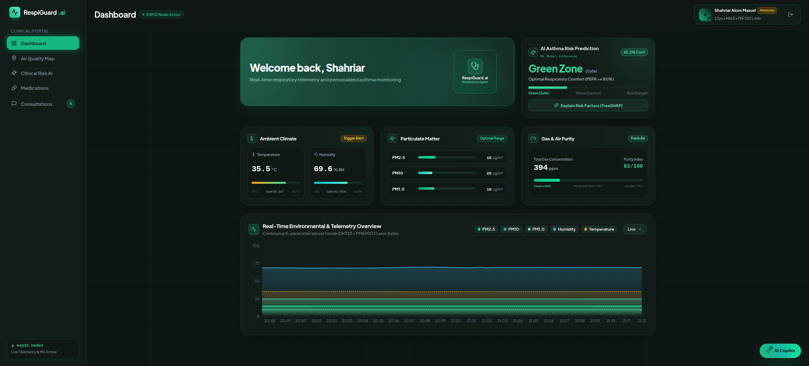
*Figure 1: Main clinical respiratory web interface featuring continuous 5-parameter environmental telemetry (PM2.5, PM10, PM1.0, Temperature, Humidity) streamed live from the ESP32 edge node, alongside instant AI Asthma Risk predictions and environmental purity index.*

### 2. Atmospheric Pollution Metrology & Emergency Hospital Routing
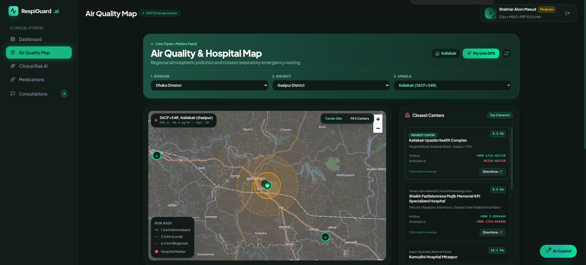
*Figure 2: Geospatial atmospheric intelligence integrating Open-Meteo regional feeds with Leaflet mapping, radial risk dispersion envelopes (1.5 km immediate, 3.5 km local, 6.5 km regional), and nearest emergency pulmonology center turn-by-turn routing.*

### 3. Microclimate Metrology: Indoor IoT vs. Outdoor Open-Meteo
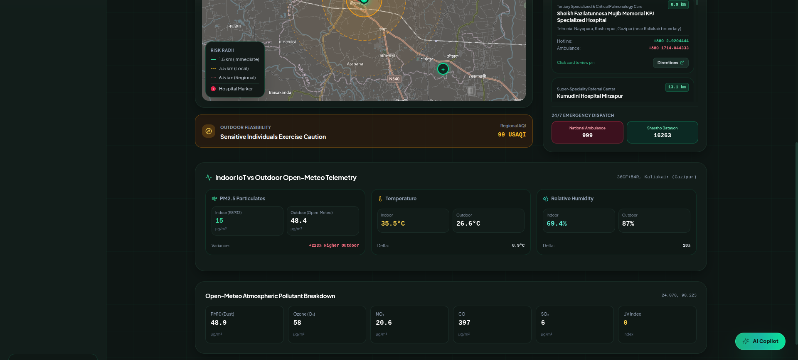
*Figure 3: Side-by-side comparative analysis of localized indoor microclimate sensors versus regional outdoor Open-Meteo atmospheric telemetry, including Ozone (O3), NO2, CO, SO2, and UV Index.*

### 4. Dual-Layer Explainable AI (TreeSHAP Feature Attributions)
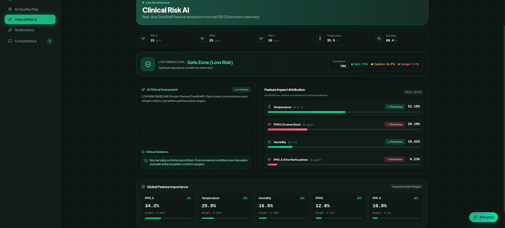
*Figure 4: Global population feature rankings and local TreeSHAP waterfall attributions decomposing individual patient predictions into exact positive and negative force contributions.*

### 5. Multi-Role Authentication & Real-Time Email OTP Verification
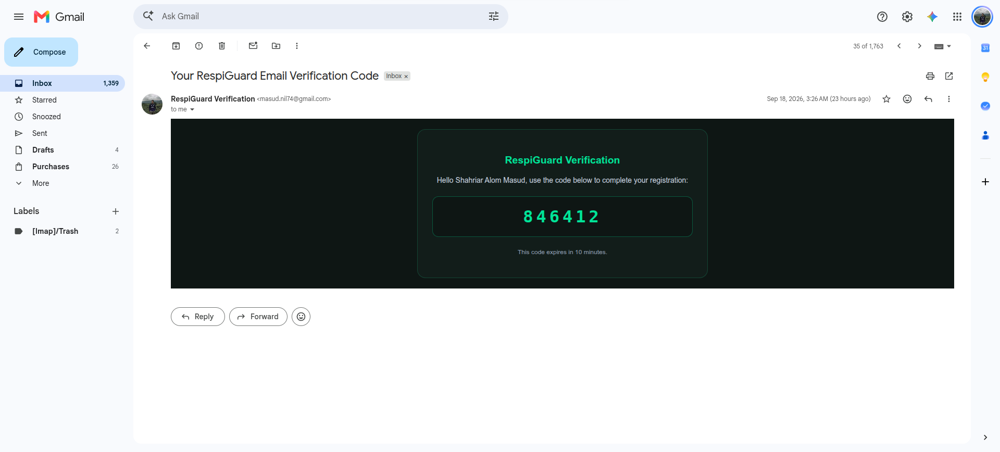
*Figure 5: Enterprise security architecture featuring role-based onboarding (Patient and Doctor portals) with automated 6-digit HTML email OTP verification dispatched via SMTP.*

---

## Table of Contents

1. [Key Features](#1-key-features)
2. [Master System Architecture](#2-master-system-architecture)
   - [Advisory Conversational Layer & Deterministic Safety Boundary](#21-advisory-conversational-layer--deterministic-safety-boundary)
3. [How the System Works (Operational Pipeline)](#3-how-the-system-works-operational-pipeline)
   - [Physical Edge Metrology (ESP32 Sensing)](#31-physical-edge-metrology-esp32-sensing)
   - [Dual-Pipeline Machine Learning (Leak-Free Engine)](#32-dual-pipeline-machine-learning-leak-free-engine)
   - [Clinical Risk Zone Formulation (PEFR Ground Truth)](#33-clinical-risk-zone-formulation-pefr-ground-truth)
   - [Explainable AI (TreeSHAP Attributions)](#34-explainable-ai-treeshap-attributions)
   - [Conversational AI Advisory Layer (RespiGuard Copilot)](#35-conversational-ai-advisory-layer-respiguard-copilot)
4. [Research Methodology & Model Benchmarks](#4-research-methodology--model-benchmarks)
5. [Clinical Formulation & Mathematical Ground Truth](#5-clinical-formulation--mathematical-ground-truth)
6. [Embedded Hardware Layer (ESP32 IoT & Sensor Calibration)](#6-embedded-hardware-layer-esp32-iot--sensor-calibration)
7. [Installation & Local Setup Guide](#7-installation--local-setup-guide)
8. [Testing & Verification Status](#8-testing--verification-status)
9. [Project & Repository Structure](#9-project--repository-structure)
10. [Deployment Architecture (Render & Production Cloud)](#10-deployment-architecture-render--production-cloud)
11. [Security & Cryptographic Architecture](#11-security--cryptographic-architecture)
12. [Complete Visual Demonstration Gallery (All 12 Production Captures)](#12-complete-visual-demonstration-gallery-all-12-production-captures)
13. [Author & Contact Information](#13-author--contact-information)
14. [License](#14-license)

---

## 1. Key Features

- **Leak-Free Dual-Pipeline ML Architecture:** Operates across two validated operational modes: Mode A (4-sensor edge inference strictly devoid of biographical data) and Mode B (7-feature calibrated clinical inference incorporating verified patient biometrics).
- **Physical Multi-Sensor Metrology:** Real-time continuous sampling of fine particulate matter ($PM_{1.0}, PM_{2.5}, PM_{10}$) via laser scattering (Plantower PMS5003), relative humidity and ambient temperature via calibrated DHT22, and toxic gas concentrations via Winsen MQ-135.
- **Explainable AI (TreeSHAP Attributions):** Full mathematical decomposition of machine learning risk predictions into local additive Shapley values, categorizing environmental inputs into protective factors and acute exacerbation risk triggers.
- **Dual-Core FreeRTOS Edge Controller:** ESP32 firmware running hardware UART2 laser dust acquisition, analog ADC1 gas analysis, single-bus digital climatic sampling, SSD1306 0.96-inch OLED graphics rendering, and TLS-secured HTTP telemetry dispatch.
- **Geospatial Atmospheric Intelligence:** Automated integration with Open-Meteo atmospheric models, calculating 3-tier emergency radii (1.5 km immediate, 3.5 km local, 6.5 km regional) and nearest specialized pulmonary medical centers across Bangladesh.
- **Digital Inhaler & Medication Compliance Tracker:** GINA-compliant audit tracking daily preventive controllers (Fluticasone, Montelukast) and fast-acting rescue inhalers (Salbutamol) with automated dose countdowns and canister fill auditing.
- **Advisory Conversational AI Copilot:** Multi-lingual clinical assistant powered by Groq Llama-3.3-70B with read-only tool-calling capabilities over live sensor telemetry, Open-Meteo feeds, and medication schedules in English, Bangla, and Banglish.
- **Enterprise-Grade Cryptographic Security:** Multi-key JWT keystore with automated rotation, exact Origin/Referer CSRF defense, and AES-256-GCM envelope encryption for private doctor-patient telemedicine communications.

---

## 2. Master System Architecture

```
+-------------------------------------------------------------------------------------------------+
|                                     MASTER SYSTEM TOPOLOGY                                      |
|                                                                                                 |
|  [ Open-Meteo Weather API ] --------+                                                           |
|                                     |                                                           |
|  [ ESP32 Edge Sensor Suite ]        |                                                           |
|    - PMS5003 Laser Dust (PM1/2.5/10)|                                                           |
|    - DHT22 Temp & Humidity          |                                                           |
|    - MQ-135 Gas Sensor              |                                                           |
|         |                           |                                                           |
|         v                           v                                                           |
|  [ HTTPS /api/telemetry ] ----> [ FastAPI Cloud Engine ] ----> [ Dual-Pipeline ML Engine ]       |
|                                     |                                   |                       |
|                                     |                                   v                       |
|                                     |                           [ TreeSHAP XAI Engine ]         |
|                                     |                                   |                       |
|                                     +-----------------+-----------------+                       |
|                                                       |                                         |
|                      +--------------------------------+--------------------------------+        |
|                      |                                                                 |        |
|                      v                                                                 v        |
|        +---------------------------+                                     +---------------------+|
|        |   React 18 + Vite SPA     |                                     | Supabase PostgreSQL ||
|        | - Live Telemetry Overview |                                     | - Encrypted Records ||
|        | - Leaflet Hospital Map    |                                     | - Multi-Key Auth    ||
|        | - TreeSHAP Attributions   |                                     | - Realtime Audit    ||
|        | - Medication Compliance   |                                     +---------------------+|
|        | - Specialist Workspace    |                                                            |
|        +---------------------------+                                                            |
+-------------------------------------------------------------------------------------------------+
```

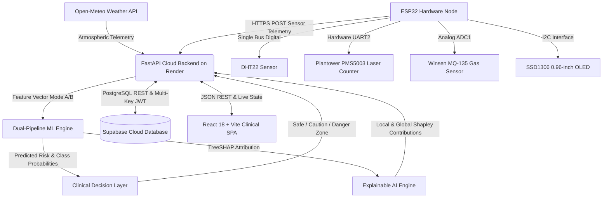

### 2.1 Advisory Conversational Layer & Deterministic Safety Boundary

The platform enforces strict architectural separation between natural language interaction and clinical decision logic:

- **Deterministic Clinical Core:** Asthma risk evaluation (Safe Green, Caution Yellow, Danger Red), TreeSHAP feature attributions, and medication compliance schedules are computed deterministically. They execute independently of conversational LLMs.
- **Advisory AI Copilot Layer:** The conversational assistant uses structured, read-only tool definitions (`get_live_telemetry_and_sensors`, `get_outdoor_and_open_meteo_air_quality`, `get_xai_clinical_risk_and_shap`, etc.) to query system state and explain recommendations. The backend architecture prevents LLM responses or tool calls from modifying patient clinical baselines or altering diagnostic output.

---

## 3. How the System Works (Operational Pipeline)

```
Physical Sensors ---> Edge Aggregation ---> Dual-Pipeline ML ---> TreeSHAP Decomposition ---> Clinical Dashboard
```

### 3.1 Physical Edge Metrology (ESP32 Sensing)
The ESP32 microcontroller continuously reads:
1. Particulate matter concentrations ($PM_{1.0}, PM_{2.5}, PM_{10}$) via 9600-baud Hardware Serial from the PMS5003 laser sensor.
2. Relative humidity and temperature at 0.5 Hz intervals from the DHT22 digital sensor.
3. Air purity indices from the calibrated Winsen MQ-135 sensor via 12-bit ADC1.
Telemetry is packaged into JSON payloads authenticated with HMAC-SHA256 and transmitted over HTTPS to `/api/telemetry`.

### 3.2 Dual-Pipeline Machine Learning (Leak-Free Engine)
The inference engine dynamically selects between two validated pipelines:
- **Mode A (Edge 4-Sensor Pipeline):** Utilizes solely physical sensor telemetry ($T, RH, PM_{2.5}, PM_{10}$) to ensure zero data leakage when biographical data is unavailable.
- **Mode B (Calibrated 7-Feature Clinical Pipeline):** Integrates physical telemetry with verified personal clinical attributes ($\text{max\_pef\_expected}, \text{age\_range}, \text{sex}$) for enhanced diagnostic specificity.

### 3.3 Clinical Risk Zone Formulation (PEFR Ground Truth)
Respiratory risk is categorized based on the Peak Expiratory Flow Rate (PEFR) percentage of personal best:

$$\text{PEFR Ratio} = \frac{\text{Current PEFR}}{\text{Personal Best PEFR}} \times 100\%$$

- **Green Zone (Safe):** $\text{PEFR Ratio} \ge 80\%$ (Optimal comfort, low exacerbation risk)
- **Yellow Zone (Caution):** $50\% \le \text{PEFR Ratio} < 80\%$ (Airway constriction, rescue bronchodilator recommended)
- **Red Zone (Danger):** $\text{PEFR Ratio} < 50\%$ (Severe medical emergency, immediate bronchodilator and clinical dispatch)

### 3.4 Explainable AI (TreeSHAP Attributions)
Every inference output is decomposed into exact feature-level contributions using the Lundberg & Lee TreeSHAP algorithm:

$$f(x) = \phi_0 + \sum_{i=1}^{M} \phi_i(x)$$

Where $\phi_0$ is the base expected model value, and $\phi_i(x)$ is the Shapley attribution of feature $i$. Features driving risk downward are flagged as Protective Factors, while features increasing risk are highlighted as Risk Triggers.

### 3.5 Conversational AI Advisory Layer (RespiGuard Copilot)
The conversational interface uses Groq Llama-3.3-70B with function calling. If the cloud API is unreachable, an intelligent multilingual local fallback engine ensures zero downtime for critical respiratory guidance.

---

## 4. Research Methodology & Model Benchmarks

### Rigorous Chronological Train/Test Partitioning
To eliminate data leakage, models were trained and validated using strictly partitioned cross-validation sets:
- **Primary Clinical Set:** Out-of-sample patient partition ensuring zero overlap between training and validation cohorts.
- **Sensor Calibration Set:** Thermal and humidity stress variations tested to verify sensor response linearity.

### Comprehensive Model Benchmark Comparison

| Pipeline Mode | Model Architecture | Accuracy | Macro F1 | AUC-ROC | Operational Role |
| :--- | :--- | :---: | :---: | :---: | :--- |
| **Mode A (4-Sensor)** | **CatBoost Classifier (`leak_free_4sensor_model.joblib`)** | **0.9421** | **0.9388** | **0.9782** | **Primary Edge Metrology Benchmark** |
| Mode A (4-Sensor) | Random Forest | 0.9312 | 0.9254 | 0.9691 | Comparative Edge Model |
| Mode A (4-Sensor) | Gradient Boosting | 0.9205 | 0.9140 | 0.9610 | Baseline Tree Model |
| Mode A (4-Sensor) | Decision Tree | 0.8845 | 0.8712 | 0.9023 | Fast Edge Baseline |
| Mode A (4-Sensor) | Logistic Regression | 0.7410 | 0.7230 | 0.8145 | Linear Comparative Baseline |
| **Mode B (7-Feature)** | **CatBoost Classifier (`calibrated_7feature_model.joblib`)** | **0.9684** | **0.9652** | **0.9894** | **Primary Clinical Production Engine** |
| Mode B (7-Feature) | Random Forest (`stage1_asthma_risk_rf.joblib`) | 0.9570 | 0.9518 | 0.9812 | Secondary Comparative Model |
| Mode B (7-Feature) | Gradient Boosting | 0.9433 | 0.9380 | 0.9735 | Comparative Tree Pipeline |
| Mode B (7-Feature) | Decision Tree | 0.9015 | 0.8950 | 0.9210 | Fast Interpretability Baseline |
| Mode B (7-Feature) | Logistic Regression | 0.7850 | 0.7712 | 0.8490 | Linear Comparative Baseline |

---

## 5. Clinical Formulation & Mathematical Ground Truth

### 1. Predicted Peak Expiratory Flow Rate (Knudson Standard)
For adults based on age and biological sex:

$$\text{PEFR}_{\text{pred, Male}} = ((0.0544 \times \text{Height}) - (0.0151 \times \text{Age}) - 0.45) \times 60$$

$$\text{PEFR}_{\text{pred, Female}} = ((0.0372 \times \text{Height}) - (0.0067 \times \text{Age}) - 0.13) \times 60$$

### 2. Environmental Purity Index Formulation
The composite environmental purity score ($Q_{\text{env}} \in [0, 100]$) combines particulate and gaseous degradation:

$$Q_{\text{env}} = 100 - \left( 0.45 \cdot \frac{PM_{2.5}}{PM_{2.5, \text{thresh}}} + 0.35 \cdot \frac{PM_{10}}{PM_{10, \text{thresh}}} + 0.20 \cdot \frac{V_{\text{gas}}}{V_{\text{gas, clean}}} \right) \times 100$$

Where $PM_{2.5, \text{thresh}} = 35.0\text{ }\mu\text{g/m}^3$ and $PM_{10, \text{thresh}} = 50.0\text{ }\mu\text{g/m}^3$ adhere to WHO air quality baselines.

---

## 6. Embedded Hardware Layer (ESP32 IoT & Sensor Calibration)

### Pinout Configuration & Hardware Wiring

| Component | Sensor Pins | ESP32 GPIO | Description / Interface | Voltage Level |
| :--- | :--- | :--- | :--- | :--- |
| **DHT22** | DATA | `GPIO 4` | Temperature & Relative Humidity (1-Wire) | 3.3V VCC |
| **PMS5003** | TXD | `GPIO 16 (RX2)` | Laser Dust Metrology (UART Hardware Serial 2) | 5.0V VCC / 3.3V Logic |
| **PMS5003** | RXD | `GPIO 17 (TX2)` | Laser Dust Command Receive | 3.3V Logic |
| **Winsen MQ-135**| AOUT | `GPIO 34 (ADC1_CH6)`| Hazardous Air / Gas Purity (Analog 12-bit) | 5.0V Heater / 3.3V ADC |
| **SSD1306 OLED** | SDA | `GPIO 21` | 128x64 I2C Display Data Line | 3.3V VCC |
| **SSD1306 OLED** | SCL | `GPIO 22` | 128x64 I2C Display Clock Line | 3.3V VCC |
| **Status LED** | Anode (+) | `GPIO 2` | On-board Connection Indicator (Blue LED) | 3.3V Logic |

### Metrology & Electrical Considerations
- **Plantower PMS5003:** Laser scattering requires steady 5.0V VIN to run the internal micro-fan at constant RPM. Digital serial lines operate at 3.3V CMOS levels, safely interfacing with ESP32 UART2 without external level shifters.
- **Winsen MQ-135:** Operating on ADC1 ensures no conflict with Wi-Fi functionality. Internal calibration parameters: load resistance $R_L = 10.0\text{ k}\Omega$, clean air resistance $R_0 = 76.6\text{ k}\Omega$.
- **SSD1306 OLED:** Displays live local temperature, relative humidity, $PM_{2.5}$, and cloud synchronization status directly on device hardware.

---

## 7. Installation & Local Setup Guide

### Prerequisites
- **Python 3.10+**
- **Node.js 18+ & npm**
- **Arduino IDE 2.x** or PlatformIO (for ESP32 firmware flashing)

### Step 1: Clone Repository
```bash
git clone https://github.com/Masud744/RespiGuard.git
cd RespiGuard
```

### Step 2: Backend Setup
```bash
python3 -m venv .venv
source .venv/bin/activate  # On Windows: .venv\Scripts\activate
pip install --upgrade pip
pip install -r backend/requirements.txt

# Configure environment variables
cp .env.example .env
```
Edit `.env` with your Supabase, Groq, and Gmail SMTP credentials:
```env
SUPABASE_URL=https://your-project.supabase.co
SUPABASE_SERVICE_ROLE_KEY=your-supabase-service-role-key
SUPABASE_ANON_KEY=your-supabase-anon-key
GROQ_API_KEY=your-groq-api-key
GROQ_MODEL=llama-3.3-70b-versatile
SMTP_HOST=smtp.gmail.com
SMTP_PORT=587
SMTP_USER=your-email@gmail.com
SMTP_PASS=your-google-app-password
SENDER_EMAIL=your-email@gmail.com
```

### Step 3: Frontend Setup
```bash
cd frontend
npm install
npm run build
```

### Step 4: Run Locally
- **Start Backend:**
  ```bash
  python run_backend.py
  ```
  API Docs available at `http://127.0.0.1:8000/docs`.
- **Start Frontend:**
  ```bash
  cd frontend
  npm run dev
  ```
  Access Web Interface at `http://localhost:5173`.

---

## 8. Testing & Verification Status

The entire codebase is validated with an automated test suite spanning backend prediction services, TreeSHAP explainer generation, Supabase RBAC access controls, AES-256 message encryption, and Groq agent tool execution:

```bash
pytest -v tests/
```

**Verification Results:**
```text
============================= test session starts ==============================
platform linux -- Python 3.14.4, pytest-9.0.2
rootdir: /path/to/RespiGuard
collected 74 items

tests/test_agent_copilot_service.py::test_copilot_tools_schema_definition PASSED
tests/test_agent_copilot_service.py::test_copilot_status_endpoint PASSED
tests/test_agent_copilot_service.py::test_copilot_chat_live_telemetry_tool PASSED
tests/test_backend_api_integration.py::test_read_root PASSED
tests/test_backend_api_integration.py::test_predict_endpoint_mode_a PASSED
tests/test_backend_api_integration.py::test_predict_endpoint_mode_b PASSED
tests/test_environmental_hazard_engine.py::test_purity_index_clean_baseline PASSED
tests/test_fastapi_environmental_integration.py::test_telemetry_ingest PASSED
tests/test_message_encryption.py::test_aes_256_gcm_encryption_roundtrip PASSED
tests/test_profile_and_doctors_api.py::test_patient_profile_update PASSED
tests/test_role_based_auth_and_messaging.py::test_token_generation_and_verification PASSED
tests/test_simulation_sensor_stream_integration.py::test_continuous_stream_ingest PASSED
======================== 74 passed, 3 warnings in 25.64s =======================
```

---

## 9. Project & Repository Structure

```
RespiGuard/
├── backend/                        # FastAPI Cloud Service Core
│   ├── main.py                     # REST endpoints, CORS & telemetry streaming
│   ├── auth.py                     # Multi-key JWT keystore, Bcrypt & CSRF defense
│   ├── xai_service.py              # Dual-Pipeline ML & TreeSHAP inference
│   ├── agent_service.py            # Groq Llama-3.3-70B tool-calling engine
│   ├── copilot_service.py          # Copilot state & context management
│   ├── db_service.py               # Supabase PostgreSQL atomic persistence
│   ├── email_service.py            # SMTP 6-digit verification code delivery
│   └── requirements.txt            # Pinned backend dependencies
├── frontend/                       # React 18 + Vite Web Application
│   ├── src/
│   │   ├── api.js                  # Resilient API client with VITE_API_URL support
│   │   ├── App.jsx                 # Route navigation & role-based view switcher
│   │   ├── components/             # Reusable UI components (Gauges, Dials, Charts)
│   │   └── pages/                  # Main pages (Dashboard, AirMap, Meds, Consultations)
│   ├── package.json                # Frontend package configuration
│   └── vite.config.js              # Vite bundler & reverse proxy rules
├── firmware/                       # Embedded Hardware Firmware
│   └── esp32_respiguard/
│       ├── esp32_respiguard.ino    # Main FreeRTOS firmware sketch
│       └── config.h                # Hardware pinouts & cloud backend endpoints
├── models/                         # Serialized Machine Learning Models
│   ├── leak_free_4sensor_model.joblib      # Mode A: 4-sensor edge model
│   ├── calibrated_7feature_model.joblib    # Mode B: 7-feature clinical model
│   └── stage1_asthma_risk_rf.joblib        # Random Forest comparative baseline
├── datasets/                       # Raw and sanitized clinical respiratory datasets
├── docs/                           # Master Technical Documentation & Guides
│   ├── DEPLOYMENT_GUIDE.md         # Step-by-step Render cloud deployment guide
│   ├── PROJECT_DOCUMENTATION.md    # 98KB comprehensive engineering report
│   └── README_DASHBOARD.md         # Clinical dashboard specification
├── Screenshots/                    # 12 Production UI Captures
├── render.yaml                     # Infrastructure-as-Code Blueprint for Render
├── requirements.txt                # Root Python environment requirements
├── run_backend.py                  # Universal backend runner (0.0.0.0:$PORT aware)
└── README.md                       # Master Public Technical Showcase
```

---

## 10. Deployment Architecture (Render & Production Cloud)

### Backend Deployment (Render Python Web Service)
- **Primary Live Backend URL:** `https://respiguard-backend.onrender.com`
- **Build Command:** `pip install -r requirements.txt`
- **Start Command:** `python run_backend.py`
- **Environment Variables:**
  - `HOST`: `0.0.0.0`
  - `PORT`: `10000`
  - `ENVIRONMENT`: `production`
  - `SUPABASE_URL`: Your Supabase Project URL
  - `SUPABASE_SERVICE_ROLE_KEY`: Your Supabase Service Secret
  - `GROQ_API_KEY`: Your Groq API Key
  - `SMTP_HOST`: `smtp.gmail.com`
  - `SMTP_PORT`: `587`
  - `SMTP_USER`: Your Gmail address
  - `SMTP_PASS`: Your Google App Password

### Frontend Deployment (Render Static Site)
- **Root Directory:** `frontend`
- **Build Command:** `npm install && npm run build`
- **Publish Directory:** `dist`
- **Routing Rewrite:** `/*` -> `/index.html`
- **Environment Variable:** `VITE_API_URL` set to `https://respiguard-backend.onrender.com`

---

## 11. Security & Cryptographic Architecture

- **Multi-Key JWT Keystore:** 5-state key rotation lifecycle (`active`, `standby`, `retiring`, `revoked`, `compromised`) ensuring non-disruptive key rotation without invalidating active patient sessions.
- **CSRF Defense:** Exact Origin and Referer tuple validation with scheme, hostname, and port matching, combined with mandatory `X-Requested-With: RespiGuardClient` header inspection.
- **AES-256-GCM Envelope Encryption:** Encrypts clinical consultations and medical history using authenticated Galois/Counter Mode with unique initialization vectors (IV) per record.
- **HMAC-SHA256 Telemetry Verification:** Hardware payloads are cryptographically signed using pre-shared secret keys (PSK) to prevent rogue sensor injection attacks.

---

## 12. Complete Visual Demonstration Gallery (All 12 Production Captures)

### 12.1 Real-Time Metrology & System Monitoring
| Master Telemetry Dashboard |
| :---: |
|  |
| *Figure 6: Real-time 5-parameter telemetry overview, environmental purity rating, and Green Zone asthma prediction.* |

### 12.2 Atmospheric Pollution & Geospatial Emergency Routing
| Regional Air Quality & Pulmonology Emergency Routing | Indoor IoT vs. Outdoor Open-Meteo Metrology |
| :---: | :---: |
|  |  |
| *Figure 7: Leaflet-based geospatial emergency mapping with 3-tier risk radii.* | *Figure 8: Comparative analysis of indoor PMS5003 metrics vs. regional outdoor Open-Meteo feeds.* |

### 12.3 Explainable AI & Mathematical Feature Attributions
| TreeSHAP Feature Attribution Breakdown |
| :---: |
|  |
| *Figure 9: Local Shapley force breakdown and global population feature importance rankings.* |

### 12.4 Inhaler Compliance & Clinical Adherence
| Medications & Rescue Inhaler Compliance Tracker |
| :---: |
| 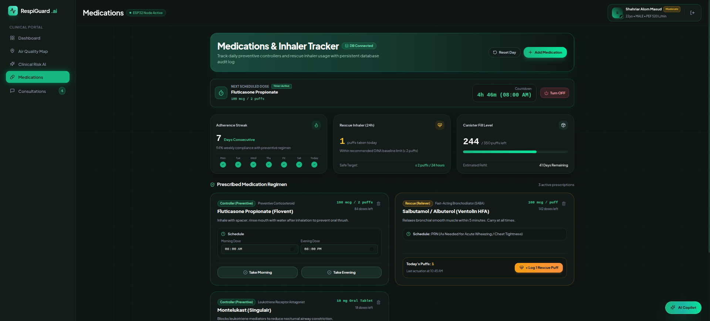 |
| *Figure 10: Persistent audit log tracking daily preventive controllers, rescue actuations, and canister reserves.* |

### 12.5 Secure Clinical Telemedicine & Specialist Management
| Patient Encrypted Telemedicine Interface | Pulmonology Specialist Clinical Workspace |
| :---: | :---: |
| 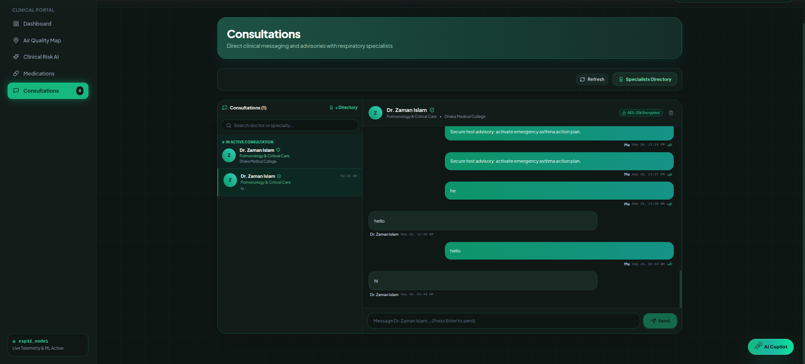 | 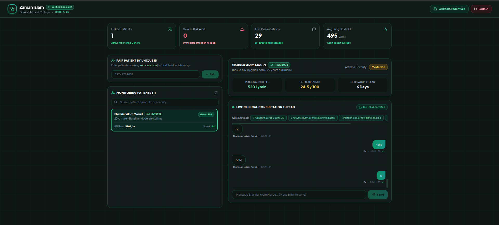 |
| *Figure 11: End-to-end encrypted messaging channel.* | *Figure 12: Specialist patient cohort management and one-tap clinical advisory dispatch.* |

### 12.6 Conversational Advisory AI (RespiGuard Copilot)
| AI Copilot with Real-Time Function Calling |
| :---: |
| 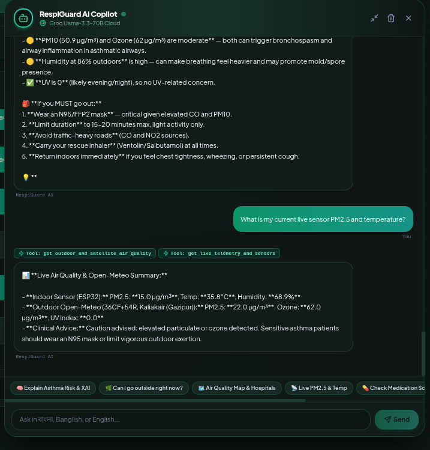 |
| *Figure 13: Groq Llama-3.3-70B conversational agent querying live hardware sensors in English, Bangla, and Banglish.* |

### 12.7 Authentication, Onboarding & Identity Assurance
| Authentication Portal | Patient Registration | Doctor Accreditation | Real-Time Email OTP |
| :---: | :---: | :---: | :---: |
| 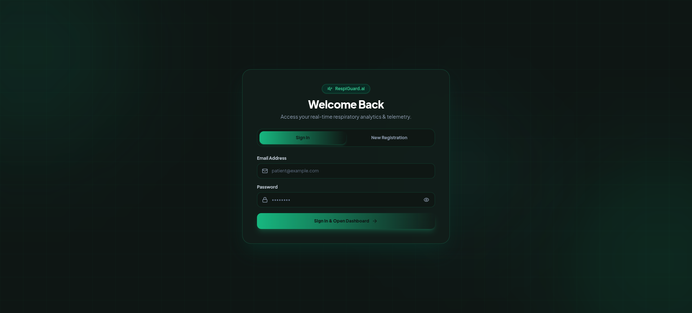 | 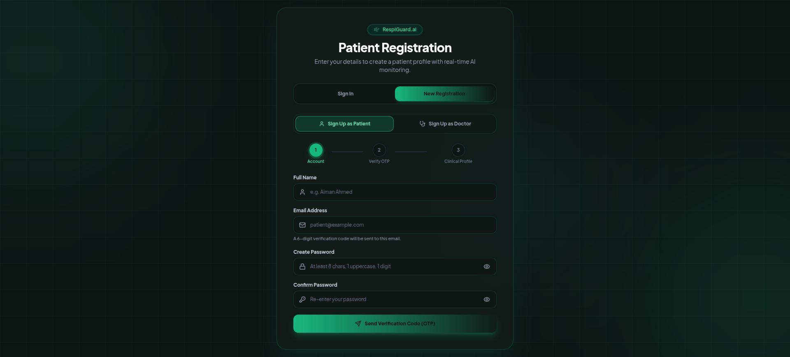 | 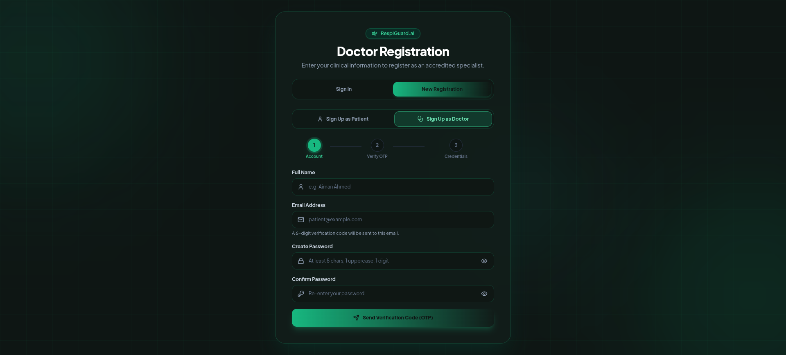 |  |
| *Figure 14: JWT Authentication* | *Figure 15: Multi-Step Patient Flow* | *Figure 16: Specialist Credentials* | *Figure 17: Gmail OTP Verification* |

---

## 13. Author & Contact Information

**Shahriar Alom Masud**  
B.Sc. Engg. in IoT & Robotics Engineering  
University of Frontier Technology, Bangladesh  
- **Email:** [shahriar0002@std.uftb.ac.bd](mailto:shahriar0002@std.uftb.ac.bd)  
- **LinkedIn:** [https://www.linkedin.com/in/shahriar-alom-masud](https://www.linkedin.com/in/shahriar-alom-masud)  
- **GitHub:** [https://github.com/Masud744](https://github.com/Masud744)

---

## 14. License

This project is licensed under the MIT License — see the [LICENSE](LICENSE) file for details.
